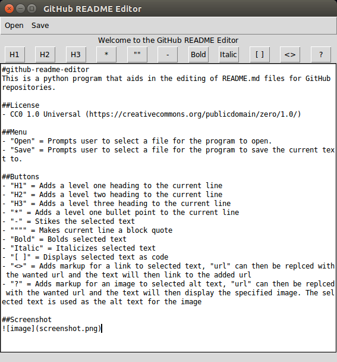

#github-readme-editor
This is a python program that aids in the editing of README.md files for GitHub repositories.

##License
- CC0 1.0 Universal (https://creativecommons.org/publicdomain/zero/1.0/)

##Menu
- "Open" = Prompts user to select a file for the program to open.
- "Save" = Prompts user to select a file for the program to save the current text to.

##Buttons
- "H1" = Adds a level one heading to the current line
- "H2" = Adds a level two heading to the current line
- "H3" = Adds a level three heading to the current line
- "*" = Adds a level one bullet point to the current line
- "-" = Stikes the selected text
- """" = Makes current line a block quote
- "Bold" = Bolds selected text
- "Italic" = Italicizes selected text
- "[ ]" = Displays selected text as code
- "<>" = Adds markup for a link to selected text, "url" can then be replced with the wanted url and the text will then link to the added url
- "?" = Adds markup for an image to selected alt text, "url" can then be replced with the wanted url and the text will then display the specified image. The selected text is used as the alt text for the image

##Screenshot

